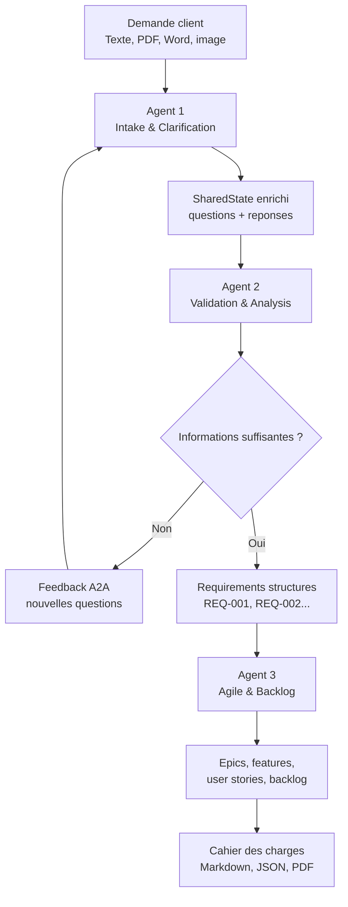

# ReqBot - Plateforme multi-agent de generation de cahier des charges

ReqBot est une plateforme intelligente d'aide a la specification logicielle. Le projet transforme une demande client brute en livrables exploitables pour une equipe projet : requirements structures, user stories, criteres d'acceptation, backlog agile et cahier des charges complet.

L'objectif principal est d'assister la phase de cadrage d'un projet informatique. Dans un contexte reel, une demande client est souvent incomplete, vague ou mal structuree. ReqBot joue le role d'un assistant d'analyse fonctionnelle : il comprend la demande, pose les bonnes questions, controle la qualite des reponses, puis genere une base documentaire claire pour lancer le projet.

---

## Table des matieres

- [Description du projet](#description-du-projet)
- [Objectifs](#objectifs)
- [Architecture globale](#architecture-globale)
- [Workflow fonctionnel](#workflow-fonctionnel)
- [Agents du systeme](#agents-du-systeme)
- [SharedState](#sharedstate)
- [Interface web](#interface-web)
- [Cahier des charges genere](#cahier-des-charges-genere)
- [Structure du projet](#structure-du-projet)
- [Technologies utilisees](#technologies-utilisees)
- [Installation locale](#installation-locale)
- [Configuration](#configuration)
- [Lancement](#lancement)
- [Utilisation](#utilisation)
- [Exports](#exports)
- [Problemes frequents](#problemes-frequents)
- [Limites actuelles](#limites-actuelles)
- [Perspectives d'evolution](#perspectives-devolution)

---

## Description du projet

ReqBot repose sur une architecture multi-agent appliquee a l'ingenierie des exigences. Le systeme recoit une demande client sous forme de texte ou de fichier, analyse automatiquement le besoin, identifie les informations importantes, detecte les zones manquantes ou ambigues, puis interagit avec l'utilisateur pour completer le contexte.

Le projet suit une logique human-in-the-loop. L'humain ne donne pas simplement une demande au debut : il intervient dans le workflow pour repondre aux questions de clarification, corriger les zones floues et valider progressivement le contexte. Les agents utilisent ensuite ces informations pour produire des artefacts utiles a une equipe projet.

Le systeme fonctionne autour de trois agents principaux :

- Agent 1 : Intake & Clarification
- Agent 2 : Validation & Analysis
- Agent 3 : Agile & Backlog

Chaque agent a un role precis. Agent 1 comprend et clarifie. Agent 2 valide et transforme le besoin en requirements. Agent 3 transforme les requirements en artefacts agiles. L'ensemble permet de passer d'une phrase client libre a un cahier des charges complet.

---

## Objectifs

Le projet vise a :

- automatiser une partie de l'analyse fonctionnelle ;
- reduire les ambiguites dans les demandes client ;
- detecter les informations manquantes avant la generation des requirements ;
- structurer les besoins sous forme d'exigences exploitables ;
- produire des user stories et un backlog agile ;
- generer un cahier des charges complet ;
- rendre visible le raisonnement des agents ;
- integrer une boucle de clarification entre humain et agents ;
- fournir une interface web simple pour piloter le workflow.

ReqBot peut etre utilise comme prototype d'assistant pour :

- analystes fonctionnels ;
- product owners ;
- chefs de projet ;
- equipes de developpement ;
- etudiants en genie logiciel ;
- projets de stage ou de recherche autour des agents intelligents.

---

## Architecture globale

Le systeme est organise autour d'un pipeline multi-agent.



Cette architecture se base sur trois idees importantes :

- Human-in-the-loop : l'utilisateur participe au processus de clarification.
- Agent-to-agent feedback : Agent 2 peut renvoyer le workflow vers Agent 1 si les informations ne sont pas suffisantes.
- SharedState : tous les agents lisent et enrichissent un etat commun.

---

## Workflow fonctionnel

Le workflow complet suit les etapes suivantes :

1. L'utilisateur saisit une demande client ou joint un fichier.
2. Agent 1 lit et nettoie l'entree.
3. Agent 1 analyse le domaine, le type de projet, les acteurs et l'objectif.
4. Agent 1 detecte les informations manquantes.
5. Agent 1 genere des questions de clarification ciblees.
6. L'utilisateur repond aux questions dans l'interface.
7. Agent 1 controle la qualite des reponses.
8. Les questions et reponses sont stockees dans le SharedState.
9. Agent 2 consolide les informations.
10. Agent 2 verifie la suffisance, les ambiguities et les contradictions.
11. Si les informations sont insuffisantes, Agent 2 renvoie un feedback A2A vers Agent 1.
12. Si les informations sont suffisantes, Agent 2 genere les requirements.
13. Agent 3 transforme les requirements en epics, features, user stories et backlog.
14. Le systeme genere un cahier des charges complet.
15. L'utilisateur peut exporter les resultats en Markdown, JSON ou PDF.

---

## Agents du systeme

### Agent 1 - Intake & Clarification

Agent 1 est responsable de la comprehension initiale de la demande client.

Il recoit :

- une demande textuelle ;
- ou un fichier client : texte, PDF, Word ou image selon les outils disponibles.

Il produit :

- le domaine du projet ;
- le type de projet ;
- les acteurs probables ;
- l'objectif principal ;
- les fonctionnalites identifiees ;
- les informations manquantes ;
- les questions de clarification.

Agent 1 ne doit pas etre statique. Il doit analyser le contexte reel de la demande et generer des questions adaptees au projet. Par exemple, pour une application de gestion de conges, il doit poser des questions sur les validateurs, les soldes, les notifications ou les types de conges. Pour un site e-commerce artisanal, il doit poser des questions sur les produits, les paiements, les artisans, les evenements ou les reservations.

Agent 1 effectue aussi un premier controle de qualite des reponses humaines. Une reponse vide, trop courte ou trop vague ne doit pas automatiquement passer a Agent 2.

Exemples de reponses insuffisantes :

- "je ne sais pas"
- "ca depend"
- "plusieurs types"
- "tous les medecins"
- "n'importe quelles statistiques"
- "les services concernes"

### Agent 2 - Validation & Analysis

Agent 2 est l'agent central du projet. Il valide la qualite des informations avant de generer les requirements.

Il recoit :

- le SharedState produit par Agent 1 ;
- la demande initiale ;
- les informations extraites ;
- les questions et reponses du stakeholder.

Il verifie :

- si les informations sont suffisantes ;
- si les reponses sont exploitables ;
- s'il existe des ambiguities ;
- s'il existe des contradictions ;
- si le contexte permet de produire des requirements precis.

Agent 2 ne doit pas seulement verifier si l'utilisateur a repondu. Il doit verifier si la reponse est utile, specifique et exploitable.

Regles importantes :

- si `missing_information` n'est pas vide, alors les informations ne sont pas suffisantes ;
- si la confiance est basse, Agent 2 doit demander une clarification ;
- si une reponse est vague, elle doit etre consideree comme insuffisante ;
- si les informations sont insuffisantes, Agent 2 ne doit pas generer les requirements ;
- si les informations sont insuffisantes, Agent 2 renvoie un feedback A2A vers Agent 1.

Quand les informations sont suffisantes, Agent 2 genere des requirements structures :

- identifiant : `REQ-001`, `REQ-002`, etc. ;
- titre ;
- description ;
- type ;
- priorite ;
- justification ;
- criteres d'acceptation si disponibles.

### Agent 3 - Agile & Backlog

Agent 3 transforme les requirements produits par Agent 2 en artefacts agiles.

Il produit :

- des epics ;
- des features ;
- des user stories ;
- des criteres d'acceptation au format Given / When / Then ;
- une priorisation MoSCoW ;
- une estimation en story points ;
- un backlog initial ;
- une matrice de tracabilite.

Exemple de transformation :

```text
REQ-001 : Le client peut soumettre une reclamation.

devient :

US-001 : En tant que client, je veux soumettre une reclamation,
afin de transmettre mon probleme au service concerne.

AC-001 :
Given un client connecte,
When il soumet une reclamation avec un titre et une description,
Then la reclamation est enregistree avec le statut "Nouvelle".
```

---

## SharedState

Le SharedState est l'etat commun utilise par les agents pour communiquer.

Il contient notamment :

- `raw_input` : demande client brute ;
- `cleaned_input` : demande nettoyee ;
- `extracted_info` : informations extraites par Agent 1 ;
- `clarification_questions` : questions posees au stakeholder ;
- `stakeholder_answers` : reponses humaines ;
- `answer_quality_issues` : problemes detectes dans les reponses ;
- `validation_analysis` : analyse de suffisance d'Agent 2 ;
- `a2a_feedback` : feedback Agent 2 vers Agent 1 ;
- `requirements` : exigences structurees ;
- `epics` : grands themes fonctionnels ;
- `features` : fonctionnalites regroupees ;
- `user_stories` : user stories generees ;
- `acceptance_criteria` : criteres d'acceptation ;
- `backlog` : backlog initial ;
- `traceability_matrix` : liens REQ -> US -> AC ;
- `agent_trace` : journal de raisonnement et decisions des agents.

Le SharedState permet de garder une coherence globale entre toutes les etapes du pipeline.

---

## Interface web

Le projet contient une interface web locale dans le dossier `interface/`.

L'interface permet de :

- saisir une demande client ;
- joindre un fichier ;
- dialoguer avec Agent 1 ;
- repondre aux questions de clarification ;
- suivre l'avancement des agents ;
- voir les requirements generes ;
- consulter les user stories et le backlog ;
- visualiser la trace de raisonnement des agents ;
- exporter le cahier des charges.

L'interface est connectee au backend Python via `interface/web_app.py`.

Important : la commande de lancement du serveur reste active dans le terminal. Ce comportement est normal, car le serveur web doit rester en execution pour que l'interface fonctionne.

---

## Cahier des charges genere

Le cahier des charges final contient les sections suivantes :

1. Presentation generale du projet
2. Description des besoins
3. Parties prenantes
4. Specifications techniques
5. Contraintes du projet
6. Livrables attendus
7. Planning previsionnel
8. Cas d'usage de test
9. Risques du projet
10. Perspectives d'evolution
11. Requirements detailles
12. Epics, features et user stories
13. Backlog initial
14. Matrice de tracabilite
15. Notes et trace des agents

L'objectif est de produire un document proche d'un vrai cahier des charges projet, pas seulement une liste de fonctionnalites.

---

## Structure du projet

```text
projet_stage/
|
|-- agents/
|   |-- agent1_intake.py
|   |-- agent2_validation.py
|   |-- agent3_agile.py
|   |-- orchestrator.py
|
|-- core/
|   |-- llm_client.py
|   |-- state.py
|   |-- tracing.py
|   |-- knowledge_base.py
|
|-- tools/
|   |-- file_reader.py
|   |-- input_analyzer.py
|   |-- clarification_generator.py
|   |-- answer_quality.py
|   |-- answer_consolidator.py
|   |-- validation_analyzer.py
|   |-- requirement_generator.py
|   |-- requirement_validator.py
|   |-- agile_artifact_generator.py
|   |-- agile_artifact_validator.py
|
|-- prompts/
|   |-- prompt_intake.py
|   |-- prompt_validation.py
|   |-- prompt_agile.py
|
|-- knowledge_base/
|   |-- requirement_schema.json
|   |-- requirement_types.json
|   |-- question_taxonomy.json
|   |-- agile_schema.json
|   |-- cahier_des_charges_template.md
|
|-- exporters/
|   |-- cahier_des_charges_exporter.py
|
|-- interface/
|   |-- web_app.py
|   |-- index.html
|
|-- requirements.txt
|-- .env.example
|-- README.md
```

---

## Technologies utilisees

- Python
- LangGraph pour l'orchestration du workflow
- Google Gemini pour les appels LLM
- Ollama en option pour un modele local
- PyMuPDF pour la lecture de PDF
- python-docx pour la lecture de documents Word
- Pillow pour certaines operations sur images
- HTML, CSS et JavaScript pour l'interface web
- Markdown, JSON et PDF pour les exports

---

## Installation locale

### 1. Cloner le projet

```powershell
git clone <url-du-repository>
cd projet_stage
```

### 2. Creer un environnement virtuel

```powershell
python -m venv .venv
```

### 3. Activer l'environnement virtuel

Sous Windows PowerShell :

```powershell
.\.venv\Scripts\Activate.ps1
```

Sous CMD :

```cmd
.venv\Scripts\activate.bat
```

### 4. Installer les dependances

```powershell
pip install -r requirements.txt
```

---

## Configuration

Le projet utilise un fichier `.env` pour les variables de configuration.

Creer un fichier `.env` a la racine du projet :

```text
GEMINI_API_KEY=ta_cle_api
LLM_PROVIDER=gemini
MODEL_NAME=gemini-3.5-flash
MAX_TOKENS=4096
GEMINI_TIMEOUT=90
GEMINI_RETRIES=2
MOCK_LLM=false
```

Pour utiliser Ollama localement :

```text
LLM_PROVIDER=ollama
OLLAMA_URL=http://127.0.0.1:11434
OLLAMA_MODEL=qwen2.5:3b
OLLAMA_TIMEOUT=240
```

Pour une demonstration sans vrai appel LLM :

```text
MOCK_LLM=true
```

Attention : le fichier `.env` contient des secrets. Il ne doit jamais etre pousse sur GitHub.

---

## Lancement

### Lancer l'interface web

```powershell
python -m interface.web_app
```

Ou :

```powershell
.\.venv\Scripts\python.exe -B -m interface.web_app
```

Puis ouvrir dans le navigateur :

```text
http://127.0.0.1:8000
```

La commande reste active dans le terminal. C'est normal : le serveur web est en cours d'execution.

Pour arreter le serveur :

```text
Ctrl + C
```

### Lancer Agent 1 en terminal

```powershell
python -m agents.agent1_intake
```

### Lancer l'orchestrateur complet en terminal

```powershell
python -m agents.orchestrator
```

---

## Deploiement sur Vercel

Le projet peut etre importe depuis GitHub vers Vercel avec le preset Python.

Vercel ne lance pas directement un serveur Python classique avec `serve_forever()`. Sa runtime Python cherche une entree compatible serverless dans `app.py`. Pour cette raison, le fichier `app.py` expose une variable top-level :

```python
handler = ReqBotHandler
```

Cette classe herite de `BaseHTTPRequestHandler` et permet a Vercel de router les requetes vers l'interface web et les endpoints API.

Variables d'environnement a ajouter dans Vercel :

```text
GEMINI_API_KEY=ta_cle_api
LLM_PROVIDER=gemini
MODEL_NAME=gemini-3.5-flash
MOCK_LLM=false
REQBOT_UPLOAD_DIR=/tmp/reqbot_uploads
REQBOT_OUTPUT_DIR=/tmp/reqbot_outputs
```

Pour une demonstration sans vrai LLM :

```text
MOCK_LLM=true
LLM_PROVIDER=local
```

Notes importantes pour Vercel :

- les fonctions Vercel sont serverless, donc les traitements tres longs peuvent etre limites ;
- les fichiers generes doivent etre consideres comme temporaires ;
- l'etat en memoire peut etre perdu si la fonction redemarre ;
- pour une version production robuste, il faudrait ajouter une base de donnees ou un stockage externe.

---

## Utilisation

Exemple de demande :

```text
Je veux une application web pour gerer les reclamations des clients d'une entreprise.
Les clients doivent pouvoir envoyer leurs reclamations, suivre leur statut et recevoir des reponses.
Les agents du service client doivent traiter les reclamations et les affecter aux bons services.
Je veux aussi avoir des statistiques sur les reclamations les plus frequentes et le temps moyen de traitement.
```

Le systeme va :

1. analyser la demande ;
2. identifier le domaine, les acteurs et l'objectif ;
3. poser des questions de clarification ;
4. attendre les reponses humaines ;
5. verifier si les reponses sont suffisantes ;
6. generer les requirements ;
7. generer les artefacts agiles ;
8. produire le cahier des charges.

---

## Exports

Les exports sont generes dans le dossier `outputs/`.

Formats disponibles :

- JSON : SharedState complet ;
- Markdown : cahier des charges lisible ;
- PDF : cahier des charges final.

Les fichiers generes ne sont pas suivis par Git.

---

## Problemes frequents

### La commande web reste bloquee

C'est normal.

```powershell
python -m interface.web_app
```

Cette commande lance un serveur web. Elle doit rester active pour que l'application soit disponible dans le navigateur.

### Erreur GEMINI_API_KEY manquant

Cela signifie que la cle API Gemini n'est pas configuree.

Solution :

```text
Creer un fichier .env avec GEMINI_API_KEY=ta_cle_api
```

### Erreur 429 quota Gemini

Cela signifie que le quota gratuit Gemini est depasse.

Solutions possibles :

- attendre le reset du quota ;
- utiliser une autre cle API ou un autre projet ;
- activer la facturation si necessaire ;
- utiliser `MOCK_LLM=true` pour une demo locale ;
- utiliser Ollama localement.

### Erreur 504 Gemini timeout

Cela signifie que l'appel au modele a pris trop de temps.

Solutions possibles :

- relancer la demande ;
- augmenter `GEMINI_TIMEOUT` ;
- reduire la taille de la demande ;
- utiliser un modele plus rapide.

### Agent 2 accepte des reponses trop vagues

Le projet contient des regles de controle pour eviter ce cas. Une reponse comme "ca depend", "tous les medecins" ou "n'importe quelles statistiques" doit etre consideree comme insuffisante.

Agent 2 doit demander une clarification supplementaire au lieu de generer directement les requirements.

---

## Limites actuelles

- La qualite des resultats depend de la qualite du modele LLM utilise.
- Les quotas Gemini peuvent limiter les tests intensifs.
- Les exports PDF dependent du contenu genere et peuvent necessiter des ajustements de mise en page.
- Le support image depend des capacites du lecteur et du modele configure.
- Le systeme est un prototype avance et peut encore etre ameliore pour un usage production.

---

## Perspectives d'evolution

Ameliorations possibles :

- ajouter une authentification utilisateur ;
- enregistrer les projets dans une base de donnees ;
- ajouter une gestion multi-projets ;
- ameliorer la generation PDF ;
- ajouter un mode collaboratif ;
- permettre la modification manuelle des requirements ;
- connecter le backlog a Jira, Trello ou GitHub Projects ;
- ajouter des tests automatises plus complets ;
- ajouter une evaluation de qualite des cahiers des charges ;
- integrer d'autres modeles LLM ;
- ameliorer la lecture des images et documents complexes.

---

## Statut du projet

ReqBot est un projet de stage / prototype avance autour de l'utilisation des agents intelligents pour l'analyse des besoins logiciels.

Le projet montre comment une architecture multi-agent peut aider a transformer une demande client non structuree en livrables projet exploitables.
